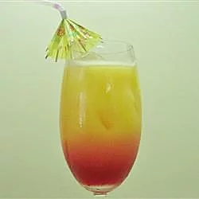

# Tequila Sunrise

[source of recipe](https://www.allrecipes.com/recipe/222510/tequila-sunrise-cocktail/)

| Prep time | Total Time | Servings |
| --------- | ---------- | -------- |
| 5 mins.   | 5 mins     | 1        |

## Ingredients
- [ ] 2.5 cups ice
- [ ] 2 oz tequila
- [ ] 4 oz Orange Juice
- [ ] .75 oz Grenadine

## Directions

1. Fill Glass with 1.5 cups Ice
2. Combine in shaker:
   - 1 cup ice
   - 2 oz tequila
   - 4 oz orange juice
3. strain into glass from step 1
4. slowly pour in .75 oz  grenadine
