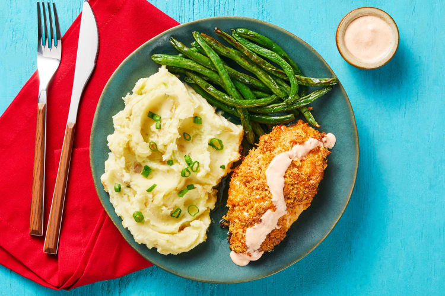

# Buffalo Spiced Crispy Chicken Cutlets

[source of recipe](https://www.hellofresh.com/recipes/buffalo-spiced-crispy-chicken-cutlets-60ae4896e817712c2c1c0aa2?q=buffalo)

| Prep time | Cook time | Total Time | Servings |
| --------- | --------- | ---------- | -------- |
| 5 mins.   | 30 mins   | 35 mins    | 2        |

## Ingredients

- [ ] 6 oz Green Beans
- [ ] 2 Scallions
- [ ] 4 Tbsp Sour Cream
- [ ] 7.2g Frank's Seasoning Blend
- [ ] 1/4 cup Panko Breadcrumbs
- [ ] 1/4 cup Monterey Jack Cheese
- [ ] 10 oz (5 each) Chicken Cutlets
- [ ] 12oz Yukon Gold Potatoes
- [ ] 2 Tbsp Honey
- [ ] 4tsp Olive Oil
- [ ] 3 tbsp Butter
- [ ] salt
- [ ] pepper

## Directions

1. Adjust oven to use top and middle racks
2. Preheat oven to 425 F
3. Wash and dry all produce
4. Trim and thinly slice `scallions`
5. Combine in small bowl:
    - 2 Tbsp `Sour Cream`
    - 1/2 tsp `Franks Seasoning Blend`
    - Large pinch of `salt`
6. Stir in water 1 tsp at a time until mixture is drizzle consistency
7. Microwave 1 Tbsp butter until melted in a medium sized bowl
8. Once Butter is melted, mix in:
    - Breadcrumbs
    - Monterey Jack Cheese
    - Large pinch of Salt
    - Large pinch of Pepper
9. Dice potatoes into half inch pieces
10. Place Potatoes into medium pot with enough salted water to cover by 2 inches
11. Bring pot of potatoes to a boil for 15-20 minutes (see step 19)
12. Drain pot, saving about 1/2 cup for later use (leave potatoes in strainer or other bowl)
13. Put now empty pot on low heat burner
14. Add:
    - drizzle of olive oil
    - scallion whites
15. Cook scallions for about a minute or until soft
16. Once soft add:
    - drained potatoes
    - 2 Tbsp `sour cream`
    - 1 Tbsp butter
17. Mash potaotes, adding reserved water as needed
18. Season with salt and pepper to taste
19. While potatoes cook, pat chicken dry with paper towel
20. season chicken all over with salt and pepper
21. place chicken on a lightly oiled baking sheet (on one side)
22. Coat top of chicken in breadcrumbs (press in firmly to make sure it stays)
23. Place green beans on the opposite side of the pan
24. Top green beans with
    - Drizzle of oil
    - pinch of salt
    - pinch of pepper
25. Roast on top rack until Chicken is cooked and golden brown (15-18 minutes, though green beans may be done before this)
26. Once green beans are cooked, pull them out
27. Toss the green beans in a bowl with 1 Tbsp of butter until melted
28. Divide chicken, green beans, potaotes, and serve. 
